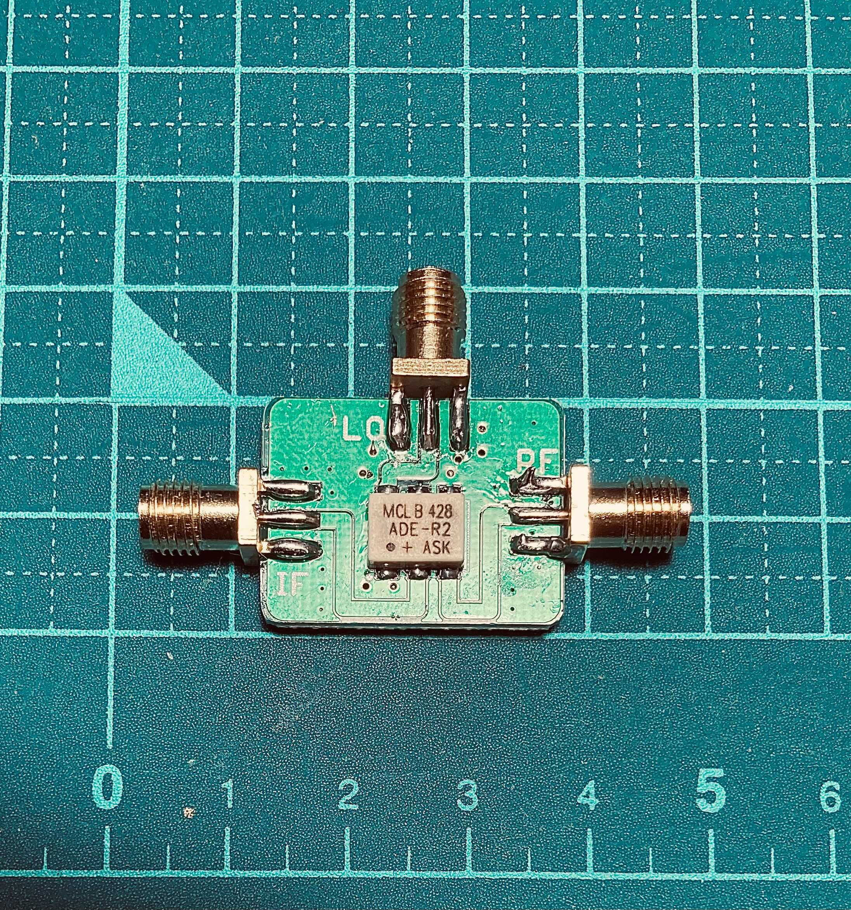

# DCRX Design 2 DBM prototyping and results

* Double-balanced mixer (DBM) experiment for DCRX
* Date: 21-AUG-2021

## DBM module

* DBM mounting board, with SMA connectors for all terminals: [GPIO Labs](https://gpio.com)'s [RF Design Kit for Mixer Mini-Circuits ADE, JMS series RF Mixers](https://gpio.com/collections/kits/products/rf-design-kit-for-mixer-mini-circuits-ade-jms-series-rf-mixers)
* DBM unit: [Mini-Circuits ADE-R2ASK+](https://www.minicircuits.com/WebStore/dashboard.html?model=ADE-R2ASK%2B)[(Datasheet)](https://www.minicircuits.com/pdfs/ADE-R2ASK+.pdf)
  - LO: +7dBm
  - LO/RF: 2 to 1000MHz
  - Conversion loss: 5.3~7.2dB
* Purchased at: <https://shop.mcl-yokohama.co.jp/items/31630235> (authorized Japanese dealer)

## Test environment

* DBM
  - RF: antenna (YouLoop) with 3dB attenuator
    - Also with GPIO Labs' [Low Noise Amplifier 100 kHz - 2000 MHz with 30dB Gain](https://gpio.com/collections/low-noise-amplifiers/products/low-noise-amplifier-100-khz-2000-mhz-with-30db-gain)
  - LO: Leo Bodnar mini GPSDO, 32mA, frequencies: 810kHz, 954kHz, 145.70MHz
  - IF: connected to a generic audio interface MIC input

## Results

* For AM radio stations: modulated signal properly decoded even without LNA
  - With LNA, IF output for the AM radio station was loud and clear
  - Intermodulation sound was detected in higher frequencies, presumably caused by lack of input filter before LNA
* For 145.70MHz: carrier generated from a 2m FM transceiver was clearly audible
  - Changes of pitch difference by +-5kHz were also well audible
  - Voice modulation was also decodable (due to AM component of the modulated signal)

## Thoughts

* Mini-Circuits DBM sufficiently meets the requirement
* Filter is required before the RF input for either with or without LNA

[End of document]